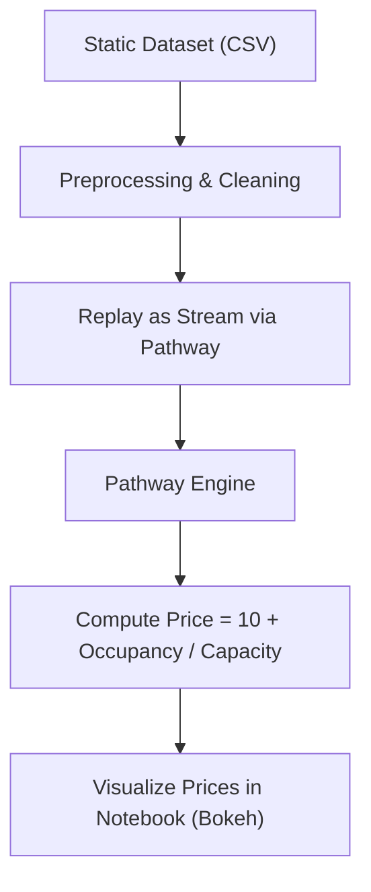
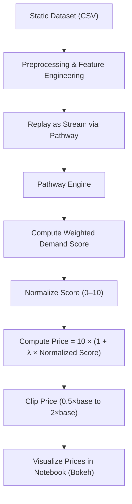

# **Dynamic Pricing for Urban Parking Lots - Hosted by Consulting & Analytics Club × Pathway**

This repository presents a Real‑Time Dynamic Pricing Engine for urban parking lots using Pathway, implemented as part of the Capstone Project for Summer Analytics ’25 at CAC, IIT Guwahati. The objective is to build a real-time, intelligent pricing engine for 14 urban parking lots using data-driven strategies and core Python tools (NumPy, Pandas, and Pathway).
The goal is to simulate smart, dynamic pricing that reflects demand, congestion, vehicle type, and nearby competition—helping optimize urban parking space allocation.

1. Model 1 – Occupancy-Based Pricing  
   - Formula: `Price = 10 + (Occupancy / Capacity)`  
   - Simple and direct calculation on each new data point.

2. Model 2 – Demand-Score Based Pricing  
   - Formula: `Price = 10 × (1 + Lambda × normalized_demand_score)`  
   - Demand Score = `Alpha × Occupancy/Capacity + Beta × QueueSmoothed − Gamma × TrafficLevel + Delta × IsSpecialDay + Epsilon × VehicleWeight`  
   - Score normalized to [0,10], price bounded in [0.5×base, 2×base]  
   - Hyperparameters (`lambda`, `alpha`, `beta`, etc.) enable custom responsiveness.

## Tech Stack

- Python – Core programming language  
- Pathway – Real-time data stream processing  
- Pandas – Data manipulation  
- Bokeh – Visualization  
- Google Colab – Interactive development

## Architecture Diagram

### Model 1 Architecture Diagram



### Model 2 Architecture Diagram



## Workflow

### Model 1: Occupancy-Based Pricing

- Load the dataset and extract features like `Occupancy`, `Capacity`, `SystemCodeNumber`, `Timestamp`.
- Perform basic data pre-processing.
- Use **Pathway** to define a real-time pipeline.
- Calculate the price using the formula:  
  `Price = 10 + Occupancy / Capacity` (per parking lot).
- Output the updated price as a live stream.
- **Visualize** the real-time prices using **Bokeh**, with tooltips and timestamps per parking space.

### Model 2: Demand Score Pricing

- Load and inspect the dataset similarly to Model 1.
- Extract relevant input features:  
  `Occupancy`, `Capacity`, `QueueSmoothed`, `TrafficConditionNearby`, `VehicleType`, `SpecialDay`.
- Define a demand score:  
  `Demand Score = Alpha × Occupancy / Capacity + Beta × QueueSmoothed − Gamma × TrafficLevel + Delta × IsSpecialDay + Epsilon × VehicleWeight`
- Normalize this score to a [0, 10] scale.
- Compute dynamic price using the formula:  
  `Price = 10 × (1 + Lambda × Normalized Demand Score)`
- Clip the final price to stay within the range `[0.5 × base, 2 × base]` for stability.
- Implement the full logic within a **Pathway** pipeline for real-time responsiveness.
- Visualize the pricing results using **Bokeh** plots for each parking lot.

## Repository Structure

```
Capstone-Project-Summer-Analytics-2025/
├── Sample_Notebook.ipynb
│   # Provided by CACIITG to demonstrate Pathway usage
├── Dynamic_Pricing_Engine_Model_1_Capstone_Project_Summer_Analytics_'25_CAC_IITG.ipynb
│   # Implementation of Model 1
├── Dynamic_Pricing_Engine_Model_2_Capstone_Project_Summer_Analytics_'25_CAC_IITG.ipynb
│   # Implementation of Model 2
├── dynamic-price-engine-model1-insights/
│   # Contains plots, Model 1 parking stream & pricing log
├── dynamic-price-engine-model2-insights/
│   # Contains plots, Model 2 parking stream & pricing log
├── problem statement.pdf
├── dataset.csv
└── README.md
```

## License and Acknowledgement

This project is developed for educational and research purposes under the **Capstone Project of Summer Analytics 2025**, CAC IIT Guwahati.

The file `Sample_Notebook.ipynb` was provided by the **CACIITG team** as a reference for using the **Pathway** framework in real-time streaming pipelines.
